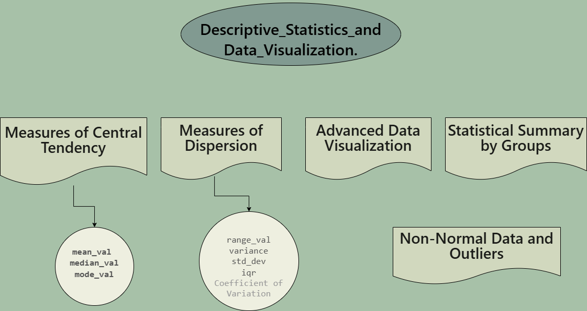

# Pepper_Prices_Analysis 


👩‍💻 I'm currently working on...

---

## *Author  [Omar Soub](https://github.com/omars1234)*

## *Overview*

*On this Project ,we will intensive data analysis techneques for Bell Pepper data set Using Python Programming*

*This Project provides the industry with a well reliable analysis that drive the decision making in the industry of Bell Pepper*

---

| **Bell Pepper -->** Three different colors |  |
|---------------------------|------------------------------------------------------------------|


---


## *Project :*


```bash
git clone https://github.com/omars1234/Pepper_Prices_Analysis.git
```

```bash
conda create --name EnvPepperPricesAnalysis python=3.12.1 -y
```

```bash
conda activate EnvPepperPricesAnalysis
```

```bash
pip install -r requirements.txt
```

---

## *Project Structure :*

### *Analysis Folder :*  

#### *00_Main :*  
* *1. Data Exploration*

   * *A. Data Description :*

     * *The historical dataset (actual.csv) ,has the following Features:*
     
       * *categorical_cols :['p_color']*
     
       * *numerical_cols : ['vietnam_season', 'price', 'total_volume', 'brazil', 'india', 'vietnam', 'indonesia', 'china', 'jordan_max_price', 'jordan_min_price', 'demand', 'supply']*

       * *boolean_cols : ['brazil_season', 'indonesia_season', 'india_season', 'china_season']*

       * *date_cols : ['week_start_dt', 'week_end_dt']*

---

* *2. Data Cleaning*

  * *1. Remove the rows with value -1*  
*2. Na Values check*  
*3. Fiiling Na vlaues using interplolate with linear moethod*  
*4. Convert week_start_dt & week_end_dt to datetime datatype*  
*5. Detect numerical_cols,categorical_cols,boolean_cols, and date_cols*  

---

* *3. Feature Engeneering*

* *Create new features from existing ones :*  
   * year  
   * month  
   * year
   * and DayOfMonth

---

* *4. Exploratory Data Analysis-EDA*   

  * *1. have a quick look at the Number of unique values in each feature*  
  * *2. numerical_cols EDA : distribution ,basic statistic summary,correlation and visualization*  
  * *3. categorical_cols EDA : distribution ,basic statistic summary and visualization*  
  * *4. boolean_cols EDA : distribution ,basic statistic summary and visualization*  

---

* *5. Features developments:*

  * *1. Rolling :Computes statistics over a fixed-size moving window*  
  * *2. Expanding : Calculates a cumulative (expanding) statistic Every new point includes all previous data up to that point*  
  * *3. ewm : Exponentially Weighted Moving (EWM) statistics give more weight to recent data and less weight to older data*  
  * *4. ewm(span=span) : Exponential Moving Weighted Average*


* *6.  Time series analysis :*

  * *1. Features developments :*  
    * *Rolling :Computes statistics over a fixed-size moving window.*  
    * *Expanding : Calculates a cumulative (expanding) statistic Every new point includes all previous data up to that point.*  
    * *ewm : Exponentially Weighted Moving (EWM) statistics give more weight to recent data and less weight to older data.*  
    * *ewm(span=span) : Exponential Moving Weighted Average*  

  * *2. 'min','mean','max' price by year and month :*   

  * *3. seperate the dataset based on the p_color :*  
    * *Visualize the monthly/yearly and weekly price resampling by color :*  

     * *Note :*  
*We can clearly see that the yellow Pepper has the highest mean price by month,year and week then Red Pepper and lastly Green Pepper*  

   * *Price EDA by p_color.*

  * *4. Red Pepper Price Analysis*

    * *'min','mean','max' price of Red Bell Pepper color by year and month*  
    * *Red Bell Pepper Features developments tables and visualizations*
  

  * *5. Green Pepper Price Analysis*

    * *'min','mean','max' price of Green Bell Pepper color by year and month*  
    * *Green Bell Pepper Features developments tables and visualizations*
  

  * *6. Yellow Pepper Price Analysis*

    * *'min','mean','max' price of Yellow Bell Pepper color by year and month*  
    * *Yellow Bell Pepper Features developments tables and visualizations* 

---


#### *01 Correlation :* 



* *A. Measures of Central Tendency*
* *B. Measures of Dispersion*
* *C. Exploration relationships between continuous variables*
  * *Create a pairplot to visualize relationships between numerical features colored by p_color*
  * *explore_correlation between continuous variables*
  * *Calculate basic correlations between continuous variables*
  * *Correlation Assumptions Vaidation - Pearson correlation.*

#### *02 Correlation_2 :*   


  * *Comprehensive correlation matrix analysis with confidence intervals*
  * *advanced correlation visualizations*
  * *Hierarchical clustering of correlation matrix*
  * *Bootstrap confidence intervals demonstration*
  * *Power analysis for correlation studies*
  * *Final report*

#### *03 Partial Correlation :* 


  * *Analyze p_color effects on correlations*
  * *correlation analysis between p_color* 
  * *Comprehensive correlation matrix analysis with confidence intervals ,and creating advanced correlation visualizations*

#### *04 Statistical Tests :* 
  * *normality check visually and with Shapiro-Wilk test*
  * *Outlier detection and visualization*
  * *advanced Normality check* 
  * *Perform Mann-Whitney U test which is a non-parametric test that compares the distributions of two independent groups*
  * *Comprehensive exploration of the categorical_data dataset with focus on price differences between p_color - ANOVA*
    * *Comprehensive check of ANOVA assumptions with visualizations and statistical tests*
    * *Perform ANOVA with manual calculations to illustrate the underlying mathematics*
    * *Create comprehensive visualizations of ANOVA results.*
    * *Perform power analysis for the ANOVA results.*
    * *Perform Tukey's Honestly Significant Difference test for post-hoc comparisons.*
  
  * *Perform Kruskal-Wallis test as non-parametric that compares the distributions of more than two independent groups - alternative to ANOVA.*
  * *create_comprehensive_summary*
  * *generate final report*
  * *power_analysis between price and binary categories*

#### *05 chi squar test :* 
  * *chi_square_test details*
  * *chi2 , carmer_V , Theil’s U*  


#### *06A Dimnetional Reduction - PCA :* 
* *Analyzing high-dimensional data characteristics.*
* *visualize_data_structure*
* *Find and display feature correlations to identify redundancy*
* *Data Preproccesing - STANDARDIZATION*
* *Implement PCA step-by-step*
* *Component Interpretation*
* *visualize_PCA*
**Component Selection and Quality Assessment* 
* *Create 3D visualization of first three principal components*
* *Assess PCA quality using reconstruction error.*
* *Visualize reconstruction quality and eigenvalue spectrum*
* *Compare original vs reconstructed data for specific samples*


#### *06C_dimensional_reduction*
* *tsne*
* *UMAP*

#### *07_Feature_Selection*
* *Using GreedyBorutaPy*

#### *08_ML_Model_Training*
* *get he best_model*
* *apply shap_model*


 ----------------------------------------

## *Feedback*

*If you have any feedback, please reach out to us at omars.soub@gmail.com*

## 🔗 Links

[*my github page-https://github.com/omars1234*](https://github.com/omars1234)

## *🛠 Skills*
*python, R, SQL ,PowerBi ,Tableaue*